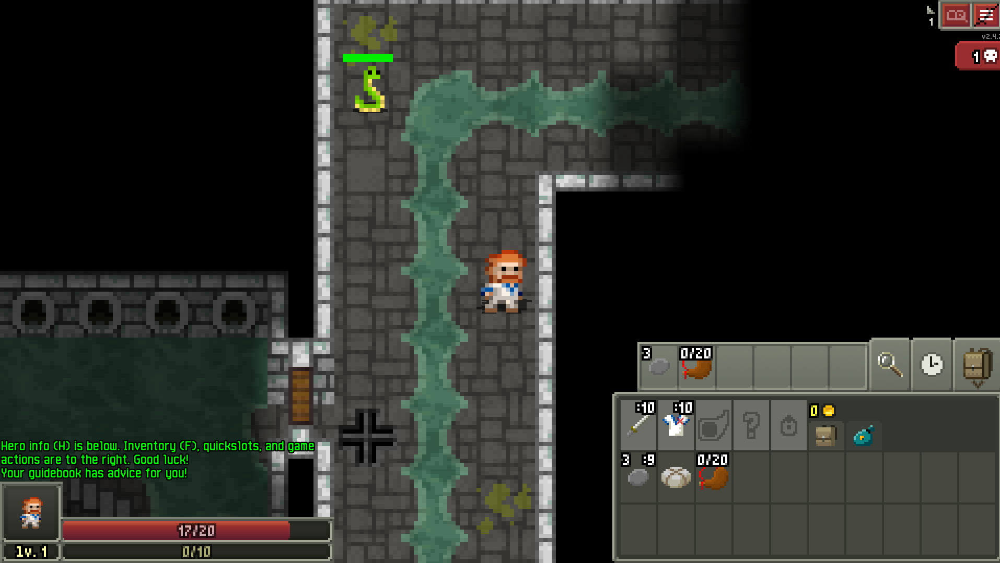

# Dungeon \[350 Points] (14 Solves) - {First Blood 🩸}
```
Enter the Dungeon to find the Pixelated Flag! It has been broken to 3 pieces, can you find them all?
```
Attached is [Dungeon.zip](./Dungeon.zip)

---

## Writeup
In the zip, we can find both sources and compiled version of a game `com.shatteredpixel.shatteredpixeldungeon`.
Running the game, I noticed that it was pretty polished, it was an actual game! \


After playing around a bit in game and looking at the code, I realized that
the chances the a full game was written for a single ctf chal are pretty
low, so I decided to Google for the mentioned name - `shatteredpixel` and in fact,
it was open source on [GitHub](https://github.com/00-Evan/shattered-pixel-dungeon)!

Alright, so we have the source code, and we have the chal code. Why not run a diff?
From the diff we can find 3 parts:
1. journal.properties - `H30n`
2. SkeletonKey.java - `U1ci`
3. items.png - `P4N7`

Which we then should use as the decryption key for the added methods
```java
public static String customDecrypt(char[] encText, String key) {
    StringBuilder result = new StringBuilder();
    int keyIndex = 0;
    int keyLength = key.length();

    for (int i = 0; i < encText.length; i++) {
        char encChar = encText[i];
        int k = key.charAt(keyIndex);
        char decChar = (char) (((encChar - i) ^ k) - i % 256);
        result.append(decChar);
        keyIndex = (keyIndex + 1) % keyLength;
    }

    return result.toString();
}

public static void main(String[] args) {
    char[] encText = {'3', '', '*', 'b', '/', 'K', 'h', '\\', 'Ñ', 'b', ')', 'b', '8', 'S', '/', ''};
    String ky = "items + journal + key";

    String decryptedText = customDecrypt(encText, ky);
    System.out.println("Decrypted: " + decryptedText);
}
```

Now we copy this code to a new java file, modify
```java
String ky = "items + journal + key";
```
to
```java
String ky = "P4N7H30nU1ci";
```

And decrypt the flag.
### Success! 🩸

**Flag:** `BSidesTLV2024{c0de_pL4y_r3pea7}`
