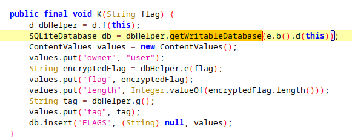

# Hooked on a Flag \[250 Points] (15 Solves) 
```
The flag is waiting for you to find it. Can you hook your way to victory?
```
Attached is [find_the_flag.apk](./find_the_flag.apk)

---

TL;DR
1. Hook `getReadableDatabase`
2. Get the sqlite encryption key
2. Retrieve the encrypted db with adb
3. Decrypt the db
4. Get the encrypted flag
5. Hook the decrypt function (b.a.a.d.d)
6. Decrypt the flag

## Writeup

From the title it's easy to guess we are going to be hooking apk functions with frida. \
If you are unfamiliar with frida, check out [this tutorial](https://erev0s.com/blog/how-hook-android-native-methods-frida-noob-friendly/).

### Recon
Opening the apk with jadx, and following `com.example.addflag` we find multiple
interesting classes. \


`addFlag`? Let's check it out \
 \
Alright, it looks like there's an SQLite database, to which we can add flags.
Few interesting things:
1. Flags have an owner
```java
values.put("owner", "user");
```
What if the actual CTF flag has a **different owner**?
*If we could get the DB, we would be able to read everything!*

2. Flags are stored encrypted
```java
String encryptedFlag = dbHelper.e(flag);
```
So even if we get the the DB, we will have to decrypt the flags.

However, that's not a problem! When we get the encrypted flag, we can _**use frida to
call the decrypt function!**_

### Running the APK
First, we need to install the apk
```
adb install find_the_flag.apk
```
And now we can just run it!

The program itself isn't very interesting \
 \
We can add new flags with `Add Flag` (which uses the class we looked at)
and then view the flags we added using `Display Flags`.

Let's open a shell with `adb` and browse the app files
```bash
adb shell
cd data/data/com.example.addflag/
ls *
```
```
cache:

code_cache:

databases:
flags.ty

files:

shared_prefs:
_has_set_default_values.xml  com.example.addflag_preferences.xml
```
`databases/flag.ty`? **That's exactly what we want!** Let's `adb pull` it.
```bash
adb pull /data/data/com.example.addflag/databases/flags.ty
```
Running `file flags.ty` we find out that it's in fact not just an sqlite database. *It's encrypted!*.
Thankfully, _**the decryption key must be somewhere in the apk.**_

### Getting the DB decryption keys
Let's look closer at how the `addFlag` class gets the db. \
 \
Hmm, `getWritableDatabase`? Let's see how it's implemented \
 \
`password`? That's exactly what we want! Let's hook this function with frida
```js
Java.perform(function () {
    let SQLiteOpenHelper = Java.use("net.sqlcipher.database.SQLiteOpenHelper");
    SQLiteOpenHelper["getReadableDatabase"].overload('java.lang.String').implementation = function (password) {
        console.log(`Got password!: ${password}`);
        return this["getReadableDatabase"](password);
    };
});
```
Run the apk with the hook `frida -U -l hook.js -f com.example.addflag`
and click on `Display Flags`.
It worked!
```
Got password!: 1l0v3ch0c0lA7e
```
Now let's decrypt `flags.ty` with `sqlcipher`
```sql
sqlite> PRAGMA key = '1l0v3ch0c0lA7e';
ok
sqlite> ATTACH DATABASE 'decrypted.db' AS decrypted KEY '';
sqlite> SELECT sqlcipher_export('decrypted'); 

sqlite> DETACH DATABASE decrypted; 
```
And get the encrypted flag with `sqlite3 decrypted.db 'SELECT * FROM FLAGS;'`.
```
system|l5wMg7HQCuXMk3Dkf3GDlLX52+VM0bZcDCQIZjyVJlKZ3hh9LMIUY13zzlgimU3IAAAAAAAAAAAAAAAAAAAAAA==|90|Tfcv8SdMzbVGThvKPAOlRw==
```
A bit weird output, let's look at the column names with `pragma table_info(FLAGS);`
```
0|owner|TEXT|0||0
1|flag|TEXT|0||0
2|LENGTH|INTEGER|0||0
3|tag|TEXT|0||0
```
Alright, so the first base64 string is the flag, and the last one is a tag? Welp, ok

### Decrypting the flag
Great! We got the encrypted flag, now we need to decrypt it. \
Where can we find that? When we click `Display Flags`, user added flags are displayed to us,
let's investigate how.

For that we will look at `DisplayFlagsActivity` in jadx.
There we will find a partially decompiled `K` function which looks like \


the `.d` method from `b.a.a.d` may remind you the `.e` method from the **same
class**, used in `addFlag` to encrypt the flag. Let's go there and see what it does \
 \
Hmm, we need a `flag` and a `tag` param. **That's exactly what we found in the db!**

We can now hook the decrypt function and call it with the params we found in the db
```js
Java.perform(function () {
    let d = Java.use("b.a.a.d");

    d["d"].implementation = function (cipherFlag, encode_tag) {
        cipherFlag = "l5wMg7HQCuXMk3Dkf3GDlLX52+VM0bZcDCQIZjyVJlKZ3hh9LMIUY13zzlgimU3IAAAAAAAAAAAAAAAAAAAAAA=="
        encode_tag = "Tfcv8SdMzbVGThvKPAOlRw=="

        let flag = this["d"](cipherFlag, encode_tag);
        console.log(`Got flag!: ${flag}`);
        return flag;
    };
});
```
Again run with
```bash
frida -U -l hook.js -f com.example.addflag
```
First, add a flag in the `Add Flag` view, with any content. This will trigger
the execution of the hook decryption function. \
And now press `Display Flags`.

### Success!


**Flag:** `BSidesTLV2024{4ndr01d_dc0mp1l3_4nd_h00k_15_fun!}`
