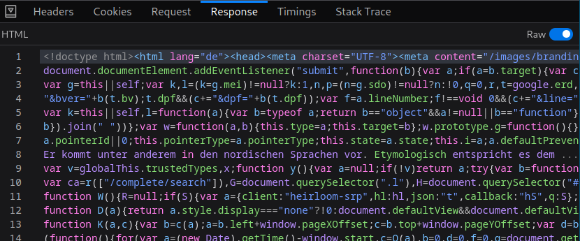

# Noogle

```
Last week I decided to create my own search engine. It was kinda hard so i piggybacked on another one. I also tried something on port 8000.

Flag format: CTF{sha256}
```
We are given a web server without source.

---

## Solution
We are given a web service which allows us to perform searches. Looking at the request the website sends to the server we notice it's a POST to the endpoint `/api/getLinks` with data being
```json
{"url":"https://www.google.com/search?q=something"}
```
And the response is the actual response of google.com


Also we are told that there's something interesting on port 8000, thus the objective is clear - get the server to return us the content of `http://localhost:8000/`.

Sadly, we can't just change the `url` in the json to be whatever we want, otherwise the server responds with `Invalid url`. Also, it looks like there's a check that the url **must** start with `https://www.google.com/`, so tricks like `https://www.google.com@localhost:8000` wouldn't work.

There's only one option left - an open redirect on `www.google.com`. After a bit of searching I found a post titled [Advisory: Open redirect on Google.com](https://wwws.nightwatchcybersecurity.com/tag/open-redirect/). It explained that on non mobile devices, a link of type `https://www.google.com/amp/whatever` will redirect us to `whatever`. Sounds great! Let's try with `localhost:8000`:


Success!

**Flag:** `CTF{9cf16d163cbaecc592ca40bee3de4b1626ee0f4a3b3db23cbd5ad921049ebc0f}`
