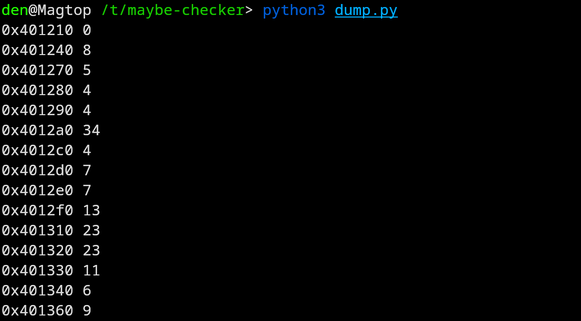
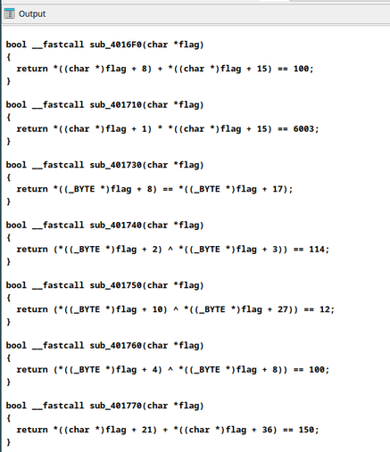

# maybe-checker \[175 Points] (53 Solves)
```
Your average flag checker with a twist.
```
Attached is [maybe-checker](./maybe-checker).

---

TL;DR

1. Dump the function decompilation with ida
2. Calculate the offsets into the input
3. Format into a z3 script
4. ~~Profit~~ Submit

## Writeup

Opening the attached binary in Ghidra, we find the following main:
```c
seed = time((time_t *)0x0);
srand((uint)seed);
printf("Enter the flag: ");
__isoc99_scanf("%s",str);
rnd = rand();
res = (**(code **)(&DAT_00402041 + ((ulong)(long)rnd % 0x3c) * 9))
              (str + (byte)(&DAT_00402040)[((ulong)(long)rnd % 0x3c) * 9]);
__s = "Wrong flag";
if (res != 0) {
__s = "MAYBE correct flag";
}
puts(__s);
return res ^ 1;
```

The code takes our flag, then randomly offsets into a an array of functions
of length 60 (0x3c). If the function returned `1` (true), then it says our flag
is "MAYBE correct".

But first, *how does it know what to call?*
```c
//    ↓              function address               ↓
//    ↓ the array ↓     ↓         the offset        ↓
res = (&DAT_00402041 + ((ulong)(long)rnd % 0x3c) * 9)(...);
```
Notice that the offset is multiplied by `9`, thus the _size_ of **an array
element** is 9 bytes:
- *8 bytes* - the function pointer
- *1 byte* - ???

Let's investigate the parameter of the function
```c
//  ↓ our input ↓  ↓       once again offset into the same array      ↓
         str     + (byte)(&DAT_00402040)[((ulong)(long)rnd % 0x3c) * 9]
```
Because `str` is a pointer, the value from the array this time will offset the input
by some amount.

**But wait!** Before that, the array was `DAT_00402041`, in Ghidra this means that its
address is at `0x402041`. *This time* it's `DAT_00402040`! \
So 1 byte less than for the function. Thus the array looks like

```
1 byte - offset for func1
8 byte - address of func1
1 byte - offset for func2
8 byte - address of func2
...
1 byte - offset for func60
8 byte - address of func60
```

Alright, let's dump this array into something we could work with.
```py
from pwn import u64

BINARY = open("./maybe_checker", "rb").read()

FUNCS_START = 0x2040  # The address the array in the binary
FUNC_COUNT = 0x3c

for arr_idx in range(FUNC_COUNT):
    bin_idx = FUNCS_START + arr_idx * 9

    offset = BINARY[bin_idx]
    addr = BINARY[bin_idx + 1 : bin_idx + 9]

    print(hex(u64(addr)), offset)
```

And run it



Great! *What now?*

Ideally, we get the decompilation of each of the functions, and the easiest way
to do so, is scripting! \
I wrote an IDA script *(although it's probably possible with Ghidra too)* to do just that:
```py
import idaapi
import ida_hexrays
import idc

func_addresses = [0x401210, ..., 0x401770] # The addresses we dumped


def define_function_at(addr):
    return idaapi.get_func(addr) or not idc.add_func(addr)

assert not ida_hexrays.init_hexrays_plugin(), "init_hexrays_plugin: Failed"

for addr in func_addresses:
    if not define_function_at(addr):
        continue

    try:
        print(ida_hexrays.decompile(addr))
    except ida_hexrays.DecompilationFailure:
        print(f"decompile({addr:#x}): Failed")

ida_hexrays.term_hexrays_plugin()
```

In the end we get the following:\


One annoying thing is that the decompilation has stuff like
```c
(*((_BYTE *)flag + 10)
```
But we want
```py
flag[10]
```
for the z3 python script. Luckily, a simple regex like (vim sed (`:%s`) syntax)
```
:s/\V*((_BYTE *)flag + \(\d\+\)/flag[\1]
```
fixes the issue.

Alright, now, all is left is to **extract the function content**,
and **add the offset from array** to the indexes in the function.

Using a couple of regexes and [vim macros](https://www.redhat.com/sysadmin/use-vim-macros)
I merged all the data we have, into python-syntax array:
```py
[
    flag[0 + 0] == 98,
    flag[1 + 0] == 119,
    flag[2 + 0] == 99,
    # ...
    (flag[10 + 9] ^ flag[27 + 9]) == 12,
    (flag[4 + 6] ^ flag[8 + 6]) == 100,
    flag[21 + 10] + flag[36 + 10] == 150,
]
```

Btw, looking at the very first function in the array, we see
```c
bool FUN_00401210(char *flag)
{
  return *flag == 'b' && flag[1] == 'w' && flag[2] == 'c' &&
     flag[3] == 't' && flag[4] == 'f' && flag[5] == '{' &&
    flag[47] == '}';
}
```
And because it checks that `flag[47]` is `}`, we know the *total* length of the flag
is `48`

So now we can write a `z3` script!
```py
from z3 import *

FLAG_LEN = 48
flag = [BitVec("flag_%d" % i, 32) for i in range(FLAG_LEN)] # NOTE: See footnote [1]

conditions = [
    flag[0 + 0] == 98,
    # ...
    flag[21 + 10] + flag[36 + 10] == 150,
]

solver = Solver()
solver.add(conditions)

# Make sure all the characters are ascii characters
for ch in flag:
    solver.add(z3.And(ch >= 32, ch <= 126))

solution_history = set()

while solver.check() == sat:
    model = solver.model()
    result = [chr(model[flag[i]].as_long()) for i in range(FLAG_LEN)]
    result_str = str("".join(result))

    # Skip existing solutions
    if result_str in solution_history: continue

    solution_history.add(result_str)
    print(result_str)
```
[^1]

Running the script we get the flag

Success!

**Flag:** `bwctf{WE1C0-M3T0B-1U3W4-T3RCT-FH0P3-Y0UH4-VEFUN}`

*For the full scripts see [dump.py](./dump.py), [solve.ida.py](./solve.ida.py) and [solve.z3.py](./solve.z3.py)*

[^1]: as SuperFashi (the author of the chal) pointed out after the CTF, the multiplication is done on 32 bit values, not on 8 bit! If we used 8 bit, we would get 4 solutions instead of 1.
